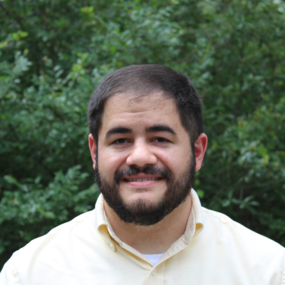
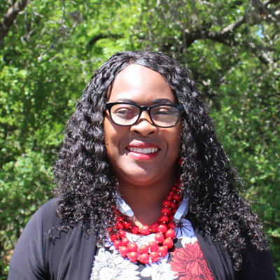

# Calvary Hills Baptist Church
## Welcome
We are a Southern Baptist Church. We are affiliated with the Baptist General Convention of Texas and the San Antonio Baptist Association. Read our [Statement of Faith](http://www.sbc.net/bfm2000/bfm2000.asp).

## Our Staff

---

**Pastor** - Jared Kress

---

**Church Secretary** - Michelle Valmé

---

**Mother's Day Out & Preschool Director** - Tina Burns

---

## Lead Volunteers

---

**Worship Team Leaders** - Kelli Burns & Carl Mehner

---

**Director of Student Ministry** - Eric Shields

---

**Sunday School Director** - Tim Shankle

---

**Discipleship Training Director** - Al Soto

---

**Safety Director** - Jesse Pullen

---

**Chairman of the Deacons** - Gene Ryder

---

## Contact Information

Church Office : 210-681-2446

## Serve and Fellowship with us
Come by Sunday morning at 9:30 for Sunday School and stay for our Worship Service at 11:00. 
Check out our regular [weekly schedule](cal.md) and come work with us in our [ministries](ministries.md)!

We are located at [910 W. Loop 1604 North](https://goo.gl/maps/YCmg9fCGHXT2)

